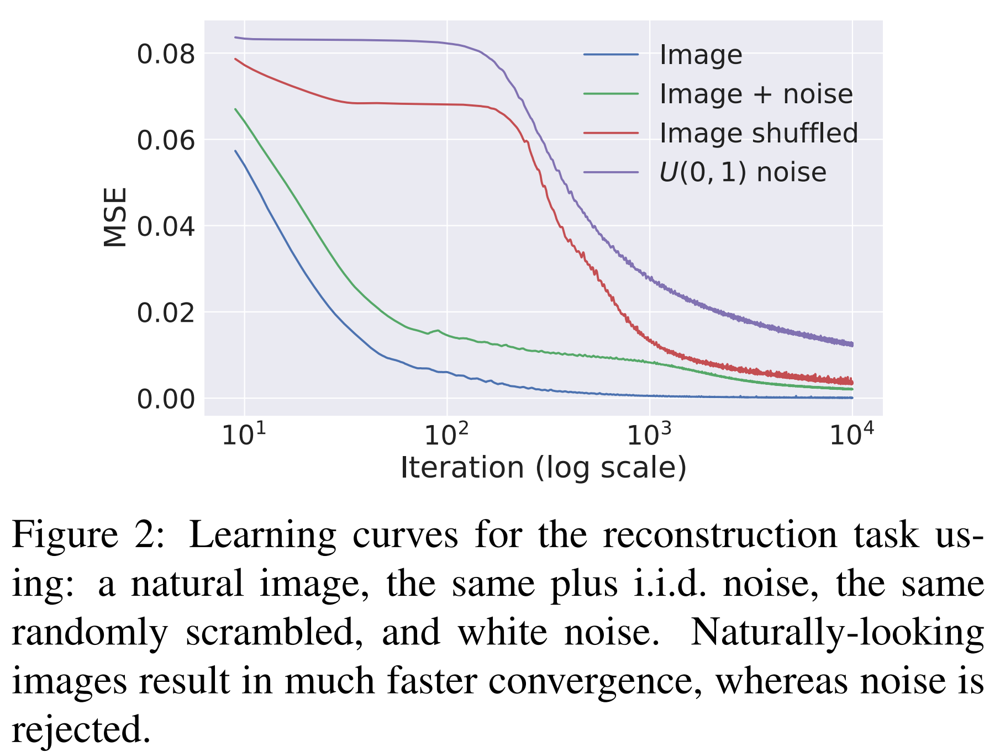
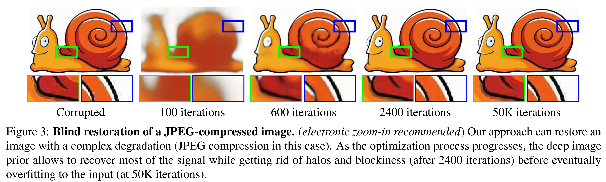

# Deep Image Prior

## 发布于

2018 CVPR

## 任务

探索网络

## 方法说明

| 总结  | 特定的网络结构具有特定的先验功能。UNet更利于一般图片而过滤高频噪声。 |
|  :----:  | :----  |
| 优点  | 无需预训练即可筛选输入图片的信息 |
| 疑惑  | 1. convolutional sparse coding   2. natural pre-image method   3. 其他的网络有什么prior|
| 改进  | 1. 更优化网络结构，探索不同网络结构的深层特性   2. 推广到频域，直接处理频率信号|

核心思想是认为网络模型是有先验的，例如模型更容易学习合理的图片内容，对于噪声会比较难学习。

验证实验如下。任务为输入一张图片，使用UNet处理，输出一张图片，输出图片尽可能重建输入图片。对于四种不同的输入，输入信息越杂乱，重建难度越大。

利用上述prior，可以利用网络模型做一个漏斗，输入一张带噪音的图片，将模型针对这张图片优化进行拟合，进行到一定的iter数量时，会恢复出图片的内容而去除掉图片的噪音。

## 分析与思考

