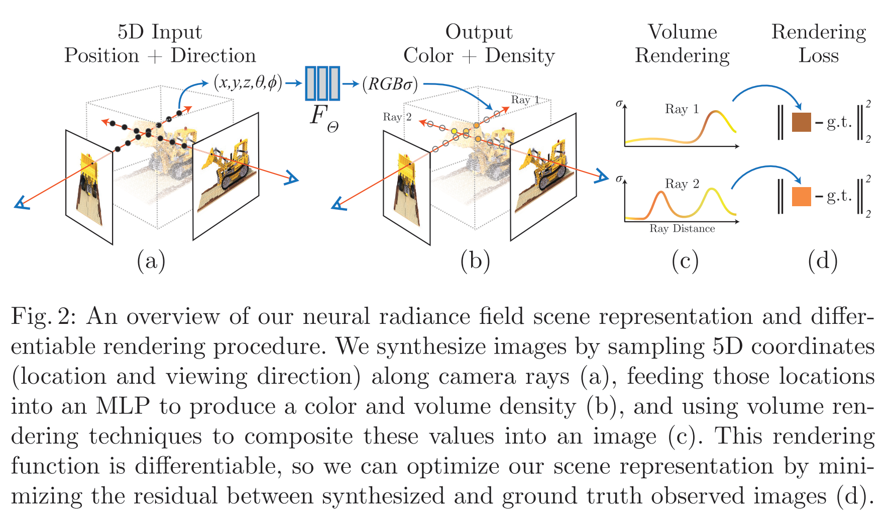
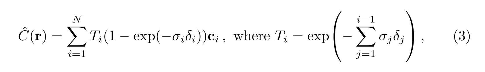
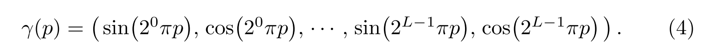

# NeRF: Representing Scenes as Neural Radiance Fields for View Synthesis@2020ECCV

## 发布于

2020 ECCV 

## 任务

三维重建

## 方法说明

| 总结  | 多视角拍摄一个场景，使用MLP存储场景信息并不断修正。MLP将（三维坐标，观察角度）map到（颜色，密度），然后在一条ray上累加作为渲染得到的新视角图片。 |
|  :----:  | :----  |
| 优点  | 连续表示一个场景。位置编码提高了细节程度。 |
| 疑惑  | 位置编码起作用的具体原因。 |

相当于是把MLP当作一个数据库，将一个场景的数据存储在这个数据库中。

如上图，为两条ray求loss的过程。可以分为以下几步：

1. sample点得到3D坐标和ray方向。在一个view的视图上找到一个像素，根据相机参数确定这个像素对应的ray，在这条ray上采样N个点，对于其中的每个点：
   1. 确定其3D坐标，ray方向，将5维数据输入到一个MLP中，输出4维数据分别表示该3D点的RGB和密度。密度是用来表示该3D位置场景的可见程度，也可以用作判断是否会遮挡其后的点。
2. 这样对于一条ray，得到了其上的N个点的空间RGB和密度。再使用下图公式将一条ray上所有点的颜色累加进行渲染，得到的RGB即为这条ray对应的图片上2D坐标的像素值。
   1. 式中，$T_i$ 表示这个点的被遮挡程度。对于第t个点，由其之前的t-1个点的不透明程度累加得到。$(1-exp(-\sigma_i \delta_i))$ 表示一个点i的不透明程度。$c_i$ 表示这个点的RGB。
3. 得到每个ray的预测像素值，和gt像素值计算loss。

### 重要trick

除了方法本身外，效果比较好的原因很大程度在这两个trick。

1. 如上图，将三维坐标先转化为高纬度。NeRF的解释是这样可以抓住更细节的信息，高维包含更多的细节。
2. 在ray上采样N个点时，先少采样一些点，粗略算出整条ray哪些区域的密度更大，然后在密度大的区域再精密采样一些点。

## 分析与思考

把NeRF理解为一个数据库，一个scene存放在一个数据库中。