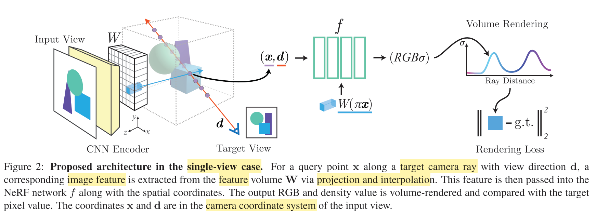

# NeRF: Representing Scenes as Neural Radiance Fields for View Synthesis@2020ECCV

## 发布于

2020 ECCV 

## 任务

三维重建

## 方法说明

| 总结  | 这篇论文基于NeRF，根据坐标取得图片特征，和坐标特征加到一起获取场景先验。通过NeRF隐藏层特征的加和实现多view融合。 |
|  :----:  | :----  |
| 优点  | 减少NeRF训练所需view的数量，通过获取图片特征，可以用不同场景图片训练同一个NeRF。属于针对性的优化。 |
| 疑惑  | 1. 图片特征直接加，完全不需要考虑深度。   2. 这个文章把image作为condition去MLP中检索，是把MLP当作了数据库，同时又当作了一个函数处理图片特征，同时具有了两面性。 3. 在input view的一个像素对应的一条ray上，他们的图片特征是相同的，也就是condition是相同的，那么在f中怎么取得目标RGB和密度？这个f的输入能不能不要xyz和d|

该方法主要贡献分两部分。第一点，如何在NeRF中集成图片特征，第二点，如何将多个view集成到同一个scene中。

### 单个view的流程

1. 如上图，从最左开始，首先使用一个encoder提取图片特征，encoder用imagenet预训练，训练NeRF时不更新参数。这一步得到的特征和像素的二维坐标对齐。

2. 输入为图中input view，目标是合成target view的图片。选定待合成的一条ray，其方向为d，在ray上sanmple N 个样本点，和NeRF相同。对于每个样本点，其方向为ray的方向d，其三维坐标为x，再找到其图片特征W($\pi$(x))。
   1. 将这一点的三维坐标x投影到input view上，插值取得图片特征W($\pi$(x))。图中蓝线一条线的图片特征是相同的，为什么不考虑深度，此为疑惑1。

3. 将x,d,W($\pi$(x)) 都使用图中的f处理，得到这一点对应的RGB和密度$\sigma$。f的内部结构如下图所示，只考虑下图中一个分支。
   1. 将x和d升维后和图片特征W相加，经过MLP处理，再次使用残差模块，得到<strong>隐藏层特征</strong>，再使用几层MLP，得到最终的RGB和$\sigma$。

### 使用多个view共同训练或者测试

使用多个view时，<strong>隐藏层特征</strong>之前是各个view独立分开的。得到各个view的隐藏层特征之后，彼此相加做平均，再使用后续的MLP。

## 分析与思考

我认为方法的有效性主要来自于集成了图片特征。在NeRF中，仅使用三维坐标和ray方向去检索点的rgb和密度，相当于是把MLP当作了一个数据库，因此需要大量的，稠密的view来矫正数据库的内容。在这里，集成了图片特征，使得对于一个场景，可以使用多个图片去学习。设想一下：

1. 在标准NeRF中，一个scene包含了一个正方体，这个正方体只能通过这个scene的众多view来学习模拟。

2. 在pixelNeRF中，scene A 包含了一个正方体，scene B 包含了一个正方体和一个球，则模型见过了scene A的两个view，也见过了scene B的两个view，它就具有了对正方体这个概念的prior。在测试时，如果出现了正方体，就可以很好的预测了。

我认为这个方法比较别扭。GRAF是把shape code 和appearance code作为condition 从MLP中取得目标scene，也达成了用一个MLP表示多个scene，减小一个scene 所需的view数量的目的。这个文章把image作为condition去MLP中检索，是把MLP当作了数据库，同时又当作了一个函数处理图片特征，同时具有了两面性。<strong>在input view的一个像素对应的一条ray上，他们的图片特征是相同的，也就是condition是相同的，那么在f中怎么取得目标RGB和密度？</strong>