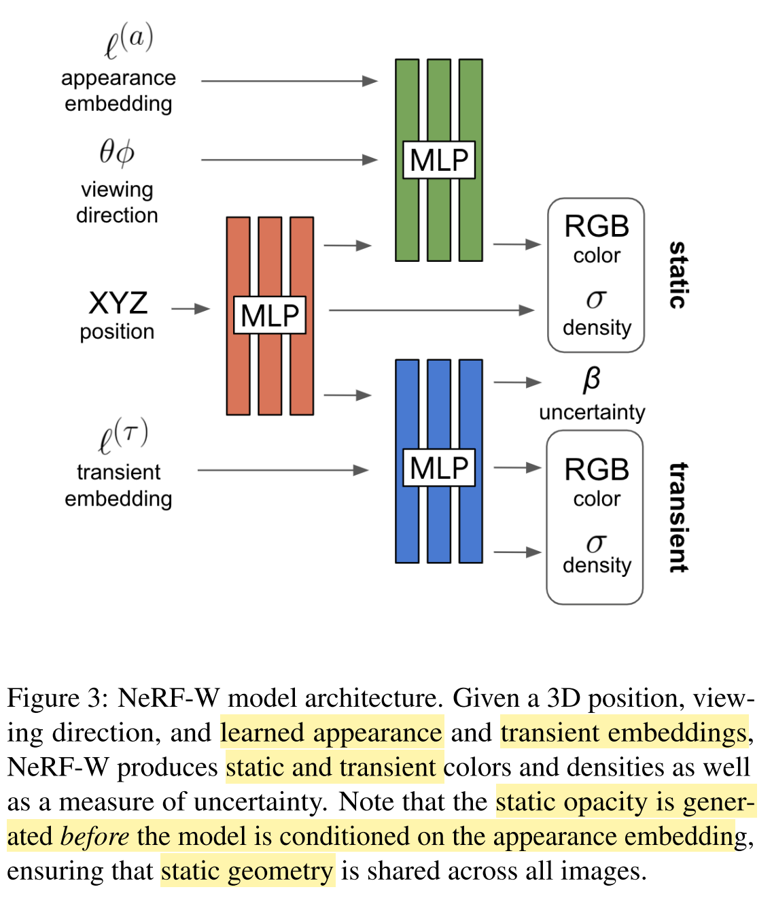
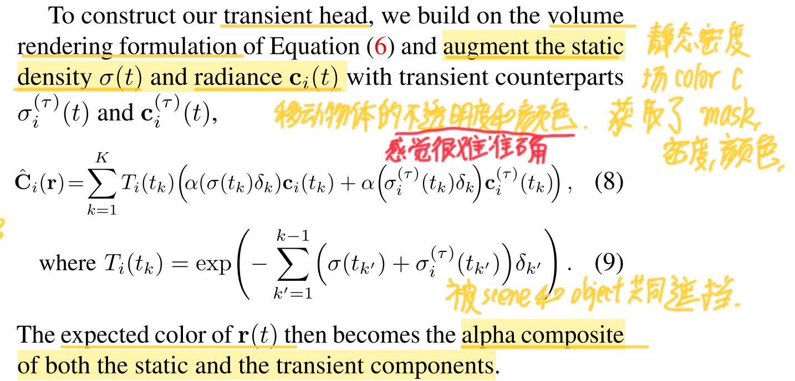
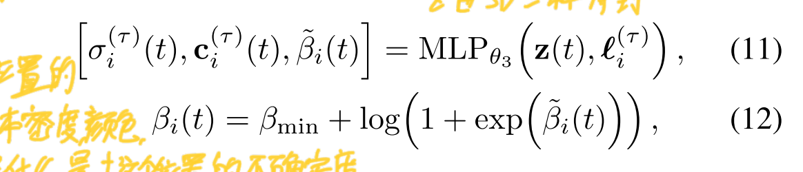
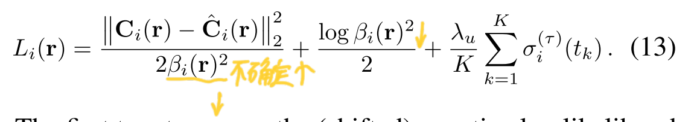
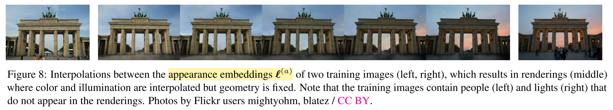
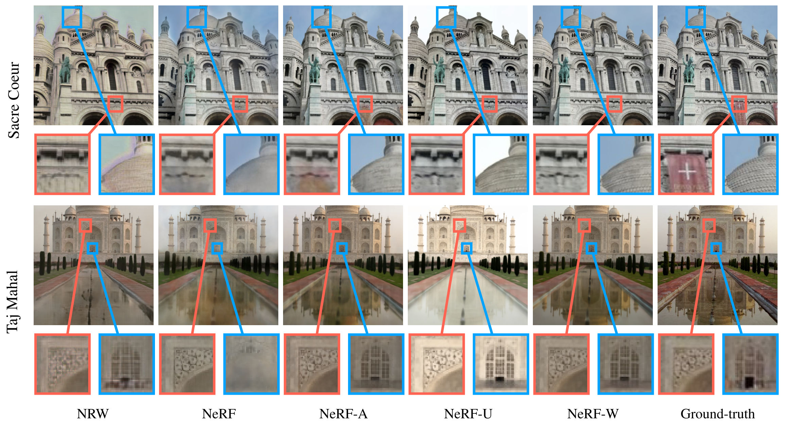

# NeRF in the Wild: Neural Radiance Fields for Unconstrained Photo Collections

## 发布于

2021 CVPR

## 任务

三维重建

## 方法说明

| 总结  | 一个模型存储一个scene。先根据3D位置取得静态场景密度，再结合风格code，渲染出特定风格的图片，风格code由训练得到。对于移动的物体，使用3D位置和移动物体的风格code得到不确定度，密度，和颜色。移动物体的密度和颜色用于渲染带风格图片再计算loss，不确定度用于减小移动物体区域的loss权重。|
|  :----:  | :----  |
| 优点  | 可以使用不同风格的图片，更接近真实世界。用不确定性降低行人的loss权重。|
| 疑惑  | 1. 不确定性是否是一个mask加上特定的loss   2. 移动物体分支的color和密度能否去除，反正也不准确。|

NeRF 要求场景是静止的，并且同时拍摄所有view的图片。应用于现实世界时有两个困难：

1. 现实中的图片不是同时拍摄的，因此会有光照，天气的变化
2. 现实中经常会有移动物体，例如行人和车辆

针对以上两个问题，NeRF in the wild 提出了两个针对性的方法：

1. 用风格code学习天气等外界变化，也就是一个condition。选取一张训练图片时同步调整它的风格code
2. 设定不确定性区域，减小这块区域的loss权重

该方法的网络结构如上图。有三个MLP，

* 橙色MLP将3D坐标转换成中间特征和静态scene的密度。
* 绿色MLP是静态head，将appearance code，观察方向，xyz得到的中间特征，得到静态场景的RGB。
* 蓝色MLP是动态Head，将xyz的中间特征，移动物体的code，得到不确定度，RGB和密度。

得到这三个MLP的结果后，通过下图公式，联合渲染静态scene和动态物体到图片上的像素RGB。这一步没有考虑不确定性。

然后使用MLP预测的 $\widetilde{\beta}_i(t)$  根据下图12式得到不确定度。这个式子还不懂。$\widetilde{a}$

得到不确定度后，用式13计算这个ray的loss，不确定度越大的地方，第一项越小，表示对整体的影响越小；第二项要求不确定度不能太大，否则全部不确定；第三项要求移动物体的密度尽可能小，不太理解什么意思。

## 结果

很好的解耦合了风格code，并且可以利用多风格的view。

相对于只用appearance的NeRF-A，用uncertainty的NeRF-U可以去除红旗的影响，是因为这样的话，只有后边建筑投影了，而红旗没有参与累加渲染。

## 分析与思考

风格code作为每个view的condition，可以利用更wild的图片。针对性的解决问题，应该学习这种思路。