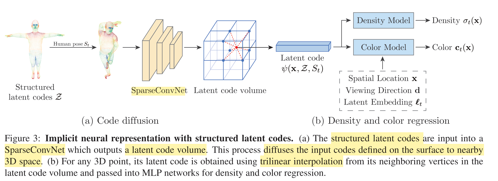
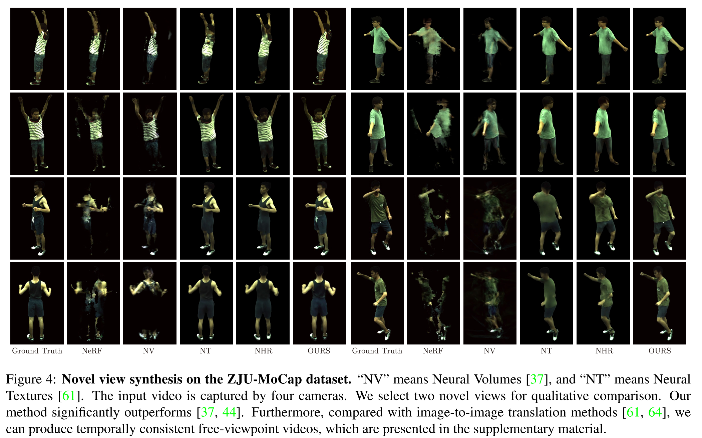

# Neural Body: Implicit Neural Representations with Structured Latent Codes for Novel View Synthesis of Dynamic Humans@2021CVPR

## 发布于

2021 CVPR

## 任务

三维重建

## 方法说明

| 总结  | 使用4个同步视频恢复人体三维结构。对人体表面进行建模，某一时刻根据4个同步帧推理pose，将人体模型根据pose转变。再使用NeRF取得密度和颜色。 |
|  :----:  | :----  |
| 优点  | 提供了一个pipeline，思路比较直观 |
| 疑惑  | 人体建模，pose获取，pose转变都是老知识 |
| 改进  | 1. 用一个视频重建一个人体   2. 用GAN数据迁移动作，作为训练数据   3. 获取泛化的，连续的pose code |

流程如上图。

1. 先根据视频重建人体表面，在表面的每个节点都设置一个latent code
2. 某一时刻t，根据4个同步帧获取pose，将人体model根据pose转换自姿态
3. 由于人体model有7000左右点较为稀疏，先用稀疏卷积下采样，增加model 上节点在voxel中的密度
4. 得到voxel后，使用NeRF流程，后续渲染生成新图片计算loss。

### 结果

## 分析与思考

一个MLP表示一个人体，经过了多个相机多个view的充分训练，因此效果较好。

希望做这样一个任务：

1. 用一个视频重建一个人体。使用一张图片或者几张图片作为condition，使用一个MLP表示多个人体。这样也能充分训练。
2. 学习到泛化又连续的pose code。人体模型用MLP表示。使用GAN生成同一个pose的不同人。
